# 📄 Document Ingestion & Chunking Pipeline

A Python pipeline built with **LangChain** that ingests, cleans, and chunks documents for downstream RAG (Retrieval-Augmented Generation) applications.

## Overview

This script processes ~10 documents from a local directory, applies text cleaning, splits them into overlapping chunks using `RecursiveCharacterTextSplitter`, and outputs detailed statistics with sample chunks for verification.

## Pipeline Architecture

```mermaid
flowchart LR
    A["📁 Documents\n(.pdf .csv .md .html .py .txt)"] --> B["1️⃣ Ingest\nLangChain Loaders"]
    B --> C["2️⃣ Clean\nNormalize & Strip"]
    C --> D["3️⃣ Chunk\nRecursiveCharacterTextSplitter\nsize=600 · overlap=100"]
    D --> E["4️⃣ Stats & Samples\nchunk_stats.json\nchunking_pipeline.log"]
```



## Supported File Types

| Extension | LangChain Loader | Notes |
|-----------|-----------------|-------|
| `.pdf` | `PyPDFLoader` | One document per page; preserves page metadata |
| `.csv` | `CSVLoader` | One document per row; metadata includes source & row index |
| `.md` | `UnstructuredMarkdownLoader` | Parses markdown structure |
| `.html` | `UnstructuredHTMLLoader` | Extracts text & structure from web pages |
| `.py` | `PythonLoader` | Preserves code structure (imports, classes, functions) |
| `.txt` | `TextLoader` | Plain text with UTF-8 encoding |

## Quick Start

### 1. Install dependencies

```bash
pip install langchain langchain-community langchain-text-splitters
pip install pypdf unstructured markdown python-docx
```

### 2. Add your documents

```
./documents/
├── report.pdf
├── data.csv
├── notes.md
├── page.html
├── script.py
├── readme.txt
└── ...
```

### 3. Run the pipeline

```bash
python document_chunking_pipeline.py
```

## Configuration

Edit the constants at the top of `document_chunking_pipeline.py`:

| Parameter | Default | Description |
|-----------|---------|-------------|
| `CHUNK_SIZE` | `600` | Max characters per chunk |
| `CHUNK_OVERLAP` | `100` | Overlap between consecutive chunks |
| `DOCS_DIR` | `./documents` | Path to your documents folder |
| `NUM_SAMPLES` | `5` | Number of sample chunks to print |

## Outputs

| File | Description |
|------|-------------|
| `chunk_stats.json` | Total chunks, avg/min/max length, chunks per document |
| `chunking_pipeline.log` | Timestamped log of every pipeline step |
| `stdout` | Summary statistics + 3–5 sample chunks |

### Example `chunk_stats.json`

```json
{
  "timestamp": "2026-02-07T14:30:00.000000",
  "config": { "chunk_size": 600, "overlap": 100 },
  "total_files": 10,
  "total_chunks": 87,
  "avg_chunk_length": 542.3,
  "min_chunk_length": 118,
  "max_chunk_length": 600,
  "chunks_per_document": {
    "report.pdf": 24,
    "data.csv": 15,
    "notes.md": 8
  }
}
```

## Cleaning Steps

The pipeline applies the following text normalization before chunking:

1. Remove null bytes and non-printable characters
2. Normalize unicode whitespace (`\u00a0`, `\u200b`)
3. Collapse 3+ consecutive blank lines into one
4. Collapse multiple spaces while preserving newlines
5. Strip leading/trailing whitespace per line

## Project Structure

```
.
├── document_chunking_pipeline.py   # Main pipeline script
├── documents/                      # Input documents (you provide these)
├── chunk_stats.json                # Generated statistics
├── chunking_pipeline.log           # Generated log file
└── README.md
```

## Next Steps

After running the pipeline:

```bash
git add document_chunking_pipeline.py chunk_stats.json chunking_pipeline.log README.md
git commit -m "feat: add LangChain document chunking pipeline"
git push origin main
```

Then share the GitHub link with your team along with a summary of the stats.

## License

MIT
